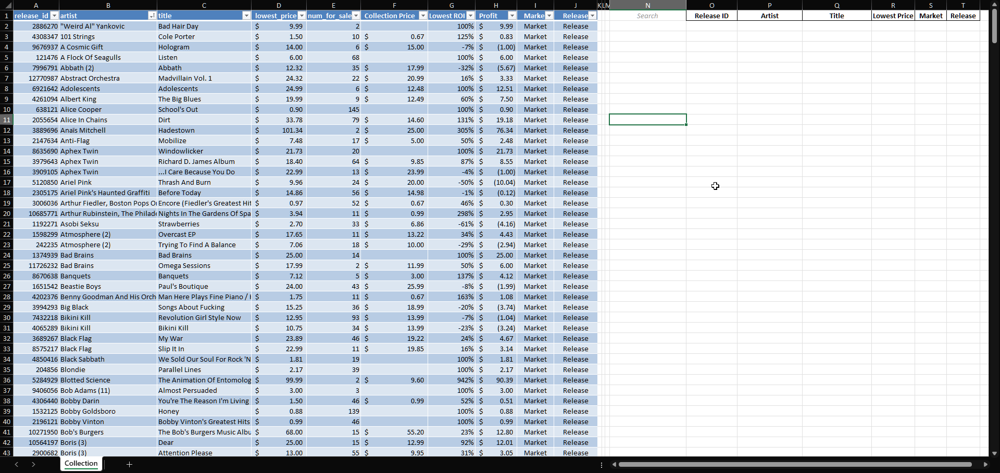

# Discogs Profit Calculation

---

A **Python** and **Excel** project that scrapes your personal Discogs collection and fetches marketplace stats to calculate the lowest resale price for each release. Data is saved as an Excel table with structured formatting for easy filtering and analysis. 

---

## Features

- Scrapes your Discogs collection using the Discogs API
- Retrieves marketplace statistics for each release
- Calculates the lowest resale price
- Saves data as a structured Excel table
- Autosaves results periodically to avoid data loss
- Includes a search function for filtering by artist, title, or release ID
- Placeholder input handled via VBA in Excel

---

## Project Background
This project was a learning exercise to practice: 
- Python API scraping
- Automatically saving data into Excel tables
- Using advanced Excel formulas for dynamic sorting and filtering

---

## Usage
* Obtain Discogs API key: https://www.discogs.com/settings/developers

* Edit the config section of discogs_pull.py:

```python
# -- config ----
API_TOKEN = "YOUR_API_KEY" # enter your Discogs API key
USERNAME = "YOUR_USERNAME" # enter your Discogs username
OUTPUT = "collection_roi_table.xlsx" # change output name
REQ_SLEEP = 1.1 # No more requests than 60/min
PER_PAGE = 100
AUTOSAVE_INTERVAL = 10  # autosave after every N releases processed
# --------------
```
* Run the Python script to fetch collection data and save it as an Excel file:

```
python discogs_pull.py
```
The output will be saved as `collection_roi_table.xlsx`.

---

## Excel Search Formula

Dynamically filter and sort your collection with J2 as the search input cell.
Results spill from L4 to O4 and expand downward automatically.
Sort is set at lowest price descending (4, -1).

* Change J2 to input cell
* Change (4, -1) to sort by (output column, order)
* Copy/Paste into output cell (currently L4)


```excel
=IF(OR($J$2="", $J$2="Search"), "", IFERROR(SORT(FILTER(CollectionTable[[release_id]:[lowest_price]], (ISNUMBER(SEARCH($J$2, CollectionTable[artist]))) + (ISNUMBER(SEARCH($J$2, CollectionTable[title]))) + (ISNUMBER(SEARCH($J$2, TEXT(CollectionTable[release_id], "0"))))), 4, -1), "Not found"))
```


```excel
Readability


=IF(OR($J$2="", $J$2="Search"), "", 
    IFERROR(
        SORT(   
            FILTER(
                CollectionTable[[release_id]:[lowest_price]], 
                (ISNUMBER(SEARCH($J$2, CollectionTable[artist]))) 
                + (ISNUMBER(SEARCH($J$2, CollectionTable[title]))) 
                + (ISNUMBER(SEARCH($J$2, TEXT(CollectionTable[release_id], "0"))))),
        4, -1), 
    "Not found")
)
```


---


## VBA Placeholder Code

Handles clearing and restoring the search placeholder in Excel
(Optional)

```VBA
Private Sub Worksheet_SelectionChange(ByVal Target As Range)
    Dim inputCell As Range
    Set inputCell = Me.Range("J2") ' change to your input cell

    ' Clear placeholder when clicked
    If Not Intersect(Target, inputCell) Is Nothing Then
        If inputCell.Value = "Search" Then
            inputCell.Value = ""
            inputCell.Font.Italic = False
            inputCell.Font.Color = vbBlack
        End If
    Else
        ' Restore placeholder if cell left empty
        If inputCell.Value = "" Then
            inputCell.Value = "Search"
            inputCell.Font.Italic = True
            inputCell.Font.Color = RGB(150, 150, 150)
        End If
    End If
End Sub
```

---

## Screenshots & Demo GIF

- **Screenshot of Excel Table:**  
  

- **Demo GIF of Filtering & Sorting:**  
  


## Acknowledgements

Assistance with coding, Excel formulas, and Python scripting was obtained from AI tools including:

- **ChatGPT (GPT-5-mini)**
- **Gemini (2.5 Flash)**
- **Claude (Sonnet 4)** — provided the most accurate and complete guidance
 

All code was actively developed and refined with human oversight — issues were identified and corrected during the process.  
